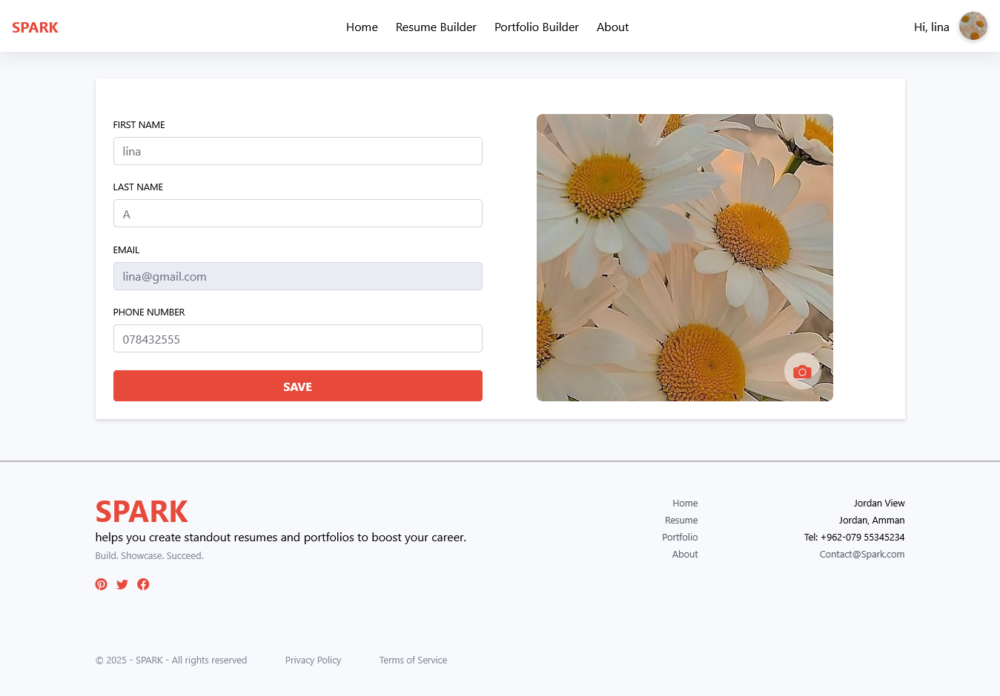

# SPARK 🔥 — Resume & Portfolio Builder Powered by AI

**SPARK** is a modern, AI-assisted resume and portfolio builder built with **.NET Core MVC**, **Entity Framework**, and  **OpenAI API**. It empowers users to craft professional resumes and  portfolios with ease, combining manual customization and AI-generated content in one seamless platform.

---

## ✨ Key Features

- ✍️ **AI-Assisted Resume & Portfolio Builder**  
  Create content manually or generate it using OpenAI for tailored, professional results.

- 👁️‍🗨️ **PDF Export**  
  Instantly export resumes in PDF format.

- 🌐 **Public Portfolio and Resume Sharing**  
  Publish personal portfolios and Resumes with flexible visibility options.

- 🔐 **Secure User Authentication**  
  Role-based access control for users and admins with account protection features.

- 📊 **Admin Dashboard**  
  View platform-wide stats and manage users, resumes, and portfolios with full oversight and control.

## 🛠 Technologies Used

- **.NET Core MVC** (C#)
- **Entity Framework Core**
- **ASP.NET Core Identity**
- **OpenAI API**
- **Bootstrap 5**
- **Razor Views**
- **SQL Server**  

---

## 📸 Screenshots

- **🏠 Home Page**  
  

- **ℹ️ About Page**  
  

  - **ℹ️ Profile Page**  
  

- **📝 Manual Resume Creation**  
   

- **🤖 AI-Assisted Resume Creation**  
  

  - **🛠 Edit Resume Page**  
  

- **🧾 Resume List Page (Private View)**  
  
  
- **🧾 Resume Details Page (Public/Private View)**  
  

   - **📝 Manual Portfolio Creation**  
  

  - **🤖 AI-Assisted Portfolio Creation**  
  

- **🛠 Edit Portfolio Page**  
  

  - **🌐 Portfolio List Page (Private View)**  
  

  - **🌐 Portfolio Details Page (Public/Private View)**  
  

- **👤 Dashboard Page (Admin only)**  
  

- **👤 Manage User Page (Admin only)**  
  

- **👤 Add User Page (Admin only)**  
  

- **✏️ Edit User Page (Admin only)**  
  

- **🔍 View User Profile Page(Admin only)**  
  

- **🚫 Access Denied Page**  
  

  - ** Login Page**  
  

- ** Register Page**  
  

---

## 📂 Pages & Routing Overview

| Page                        | Description                                     | Access Level         |
|-----------------------------|-------------------------------------------------|----------------------|
| **Home Page**               | Landing page with website overview              | Public               |
| **About Page**              | Description of purpose, vision, and contact     | Public               |
| **Access Denied Page**      | Displayed when unauthorized access is attempted | Public (System)      |
| **Create Resume (Manual)**  | Manual form to build a resume                   | Authenticated Users  |
| **Create Resume (AI)**      | Uses OpenAI API to generate content             | Authenticated Users  |
| **Edit Resume**             | Modify saved resumes                            | Authenticated Users  |
| **Resume Page**             | View List of resumes                            |Private               |
| **Resume Details**          | View  resume details                            |Public/Private        |
| **Create Portfolio(Manual)**| Manual form to build a portfolio                | Authenticated Users  |
| **Create Portfolio(AI)**    | Uses OpenAI API to generate content             | Authenticated Users  |
| **Edit Portfolio**          | Update portfolio projects/content               | Authenticated Users  |
| **Portfolio Page**          | View List of portfolios                         | Private              |
| **Portfolio Details**       | View  portfolio details                         |Public/Private        |
| **Add/Edit/View User**      | Admin panel for user management                 | Admin Only           |
| **User Profile**            | View user info                                  | User Only            |

---
<!-- Screenshot Gallery -->
<h2>📸 Screenshots</h2>

  <!-- Home Page -->
  

    <h4>🏠 Home Page</h4>
    
  

  <!-- About Page -->
  

    <h4>ℹ️ About Page</h4>
    
  

  <!-- Profile Page -->
  

    <h4>👤 Profile Page</h4>
    
  

  <!-- Manual Resume Creation -->
  

    <h4>📝 Manual Resume Creation</h4>
    
  

  <!-- AI Resume Generation -->
  

    <h4>🤖 AI Resume Generation</h4>
    
  

  <!-- Resume Details -->
  

    <h4>🧾 Resume Details</h4>
    
  

  <!-- Portfolio List -->
  

    <h4>🌐 Portfolio List</h4>
    
  

  <!-- Admin Dashboard -->
  

    <h4>👤 Admin Dashboard</h4>
    
  

